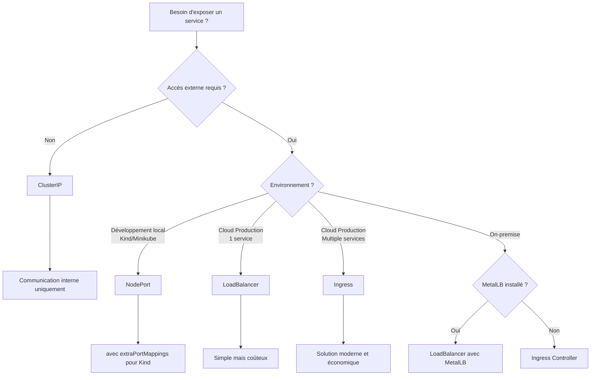

# 📊 Comparaisons et Bonnes Pratiques

## 🎯 Récapitulatif des Types de Services

| Type | Usage Principal | Accessibilité | Coût | Environnement |
|------|----------------|---------------|------|---------------|
| **ClusterIP** | Communication interne | Cluster uniquement | Gratuit | Tous |
| **NodePort** | Développement/Test | IP nœuds + port | Gratuit | Kind/Minikube |
| **LoadBalancer** | Production simple | IP publique | ~$18/mois/LB | Cloud uniquement |
| **Ingress** | Production moderne | IP publique | ~$18/mois total | Tous (avec controller) |

## 🏗️ Architectures Recommandées

### 🛠️ Développement Local

```yaml
# Kind/Minikube avec NodePort
apiVersion: v1
kind: Service
metadata:
  name: webapp-dev
  annotations:
    dev.local/url: "http://localhost:31200"
spec:
  type: NodePort
  selector:
    app: webapp
  ports:
    - port: 80
      targetPort: 8080
      nodePort: 31200
```

**Avantages :**
- ✅ Accès rapide et simple
- ✅ Pas de configuration complexe
- ✅ Parfait pour le développement

### 🧪 Environnement de Test/Staging

```yaml
# Ingress avec certificats de staging
apiVersion: networking.k8s.io/v1
kind: Ingress
metadata:
  name: staging-ingress
  annotations:
    cert-manager.io/cluster-issuer: "letsencrypt-staging"
    nginx.ingress.kubernetes.io/auth-type: basic
    nginx.ingress.kubernetes.io/auth-secret: staging-auth
spec:
  ingressClassName: nginx
  tls:
  - hosts:
    - staging.example.com
    secretName: staging-tls
  rules:
  - host: staging.example.com
    http:
      paths:
      - path: /
        pathType: Prefix
        backend:
          service:
            name: webapp-staging
            port:
              number: 80
```

**Avantages :**
- ✅ Configuration proche de la production
- ✅ SSL de test
- ✅ Authentification pour protéger l'accès

### 🚀 Production Cloud

```yaml
# Architecture complète avec Ingress
# 1. Services ClusterIP
apiVersion: v1
kind: Service
metadata:
  name: frontend-service
spec:
  type: ClusterIP
  selector:
    app: frontend
  ports:
    - port: 80
      targetPort: 3000

---
apiVersion: v1
kind: Service
metadata:
  name: api-service
spec:
  type: ClusterIP
  selector:
    app: api
  ports:
    - port: 8080
      targetPort: 8080

---
# 2. Ingress avec SSL et routing
apiVersion: networking.k8s.io/v1
kind: Ingress
metadata:
  name: production-ingress
  annotations:
    cert-manager.io/cluster-issuer: "letsencrypt-prod"
    nginx.ingress.kubernetes.io/rate-limit: "1000"
spec:
  ingressClassName: nginx
  tls:
  - hosts:
    - www.example.com
    - api.example.com
    secretName: production-tls
  rules:
  - host: www.example.com
    http:
      paths:
      - path: /
        pathType: Prefix
        backend:
          service:
            name: frontend-service
            port:
              number: 80
  - host: api.example.com
    http:
      paths:
      - path: /
        pathType: Prefix
        backend:
          service:
            name: api-service
            port:
              number: 8080
```

## 🎯 Décision : Quel Service Choisir ?

### 🤔 Flowchart de Décision



### 📋 Questions à se Poser

1. **Où s'exécute mon cluster ?**
   - Kind/Minikube → NodePort (avec port mapping)
   - Cloud (AWS/Azure/GCP) → LoadBalancer ou Ingress
   - On-premise → Ingress ou MetalLB

2. **Combien de services dois-je exposer ?**
   - 1 service → LoadBalancer acceptable
   - 2+ services → Ingress recommandé

3. **Ai-je besoin de fonctionnalités avancées ?**
   - SSL automatique → Ingress
   - Rate limiting → Ingress
   - Routage complexe → Ingress

4. **Budget ?**
   - Gratuit → ClusterIP/NodePort
   - $18/mois → 1 LoadBalancer
   - $18/mois pour tous → Ingress

## 💡 Bonnes Pratiques Universelles

### 1. **Nommage Cohérent**

```yaml
# ✅ Convention recommandée
metadata:
  name: webapp-frontend-service
  labels:
    app: webapp
    component: frontend
    version: v1.2.0
    tier: web
```

### 2. **Labels et Sélecteurs**

```yaml
# ✅ Labels descriptifs
spec:
  selector:
    app: webapp
    component: frontend
    version: v1.2.0
    
# ❌ Labels vagues
spec:
  selector:
    app: app1
```

### 3. **Documentation dans les Annotations**

```yaml
metadata:
  annotations:
    description: "Service principal pour l'application web"
    owner: "team-frontend"
    contact: "frontend@example.com"
    documentation: "https://wiki.example.com/webapp"
    monitoring.dashboard: "https://grafana.example.com/d/webapp"
    cost-center: "engineering"
```

### 4. **Health Checks dans les Pods**

```yaml
# Pods avec health checks pour les services
spec:
  containers:
  - name: webapp
    image: webapp:1.2.0
    ports:
    - containerPort: 8080
    readinessProbe:
      httpGet:
        path: /ready
        port: 8080
      initialDelaySeconds: 5
      periodSeconds: 5
    livenessProbe:
      httpGet:
        path: /health
        port: 8080
      initialDelaySeconds: 30
      periodSeconds: 10
```

### 5. **Gestion des Namespaces**

```yaml
# Services par environnement
---
# development namespace
apiVersion: v1
kind: Service
metadata:
  name: webapp-service
  namespace: development
spec:
  type: NodePort
  nodePort: 31200

---
# staging namespace  
apiVersion: v1
kind: Service
metadata:
  name: webapp-service
  namespace: staging
spec:
  type: ClusterIP  # Ingress gérera l'exposition

---
# production namespace
apiVersion: v1
kind: Service
metadata:
  name: webapp-service
  namespace: production
spec:
  type: ClusterIP  # Ingress gérera l'exposition
```

## 🔒 Sécurité des Services

### 1. **Limitation d'Accès par IP**

```yaml
# LoadBalancer avec restriction d'IP
spec:
  type: LoadBalancer
  loadBalancerSourceRanges:
  - "203.0.113.0/24"  # Bureau
  - "198.51.100.0/24" # VPN

# Ingress avec whitelist
metadata:
  annotations:
    nginx.ingress.kubernetes.io/whitelist-source-range: "203.0.113.0/24,198.51.100.0/24"
```

### 2. **Network Policies**

```yaml
apiVersion: networking.k8s.io/v1
kind: NetworkPolicy
metadata:
  name: api-network-policy
spec:
  podSelector:
    matchLabels:
      app: api
  policyTypes:
  - Ingress
  - Egress
  ingress:
  - from:
    - namespaceSelector:
        matchLabels:
          name: frontend
    ports:
    - protocol: TCP
      port: 8080
```

### 3. **TLS et Certificats**

```yaml
# Force HTTPS
metadata:
  annotations:
    nginx.ingress.kubernetes.io/ssl-redirect: "true"
    nginx.ingress.kubernetes.io/force-ssl-redirect: "true"
    
    # HSTS
    nginx.ingress.kubernetes.io/server-snippet: |
      add_header Strict-Transport-Security "max-age=31536000; includeSubDomains" always;
```

## 📊 Monitoring et Observabilité

### 1. **Metrics des Services**

```yaml
metadata:
  annotations:
    prometheus.io/scrape: "true"
    prometheus.io/port: "8080"
    prometheus.io/path: "/metrics"
```

### 2. **Logs Structurés**

```yaml
# Annotations pour la collecte de logs
metadata:
  annotations:
    fluentd.org/parser: "json"
    logging.coreos.com/enable: "true"
```

### 3. **Tracing Distribué**

```yaml
# Ingress avec tracing
metadata:
  annotations:
    nginx.ingress.kubernetes.io/enable-opentracing: "true"
    nginx.ingress.kubernetes.io/jaeger-collector-host: "jaeger-collector.tracing:14268"
```

## 🔄 Patterns de Déploiement

### 1. **Blue-Green Deployment**

```yaml
# Service principal
apiVersion: v1
kind: Service
metadata:
  name: webapp-service
spec:
  selector:
    app: webapp
    version: blue  # Changer vers "green" pour basculer
  ports:
    - port: 80
      targetPort: 8080
```

### 2. **Canary Deployment avec Ingress**

```yaml
# Ingress principal (90% du trafic)
apiVersion: networking.k8s.io/v1
kind: Ingress
metadata:
  name: webapp-main
spec:
  rules:
  - host: example.com
    http:
      paths:
      - path: /
        pathType: Prefix
        backend:
          service:
            name: webapp-v1-service
            port:
              number: 80

---
# Ingress canary (10% du trafic)
apiVersion: networking.k8s.io/v1
kind: Ingress
metadata:
  name: webapp-canary
  annotations:
    nginx.ingress.kubernetes.io/canary: "true"
    nginx.ingress.kubernetes.io/canary-weight: "10"
spec:
  rules:
  - host: example.com
    http:
      paths:
      - path: /
        pathType: Prefix
        backend:
          service:
            name: webapp-v2-service
            port:
              number: 80
```

## 🛠️ Outils et Scripts Utiles

### 1. **Script de Debug Services**

```bash
#!/bin/bash
# debug-service.sh

SERVICE_NAME=$1
NAMESPACE=${2:-default}

echo "🔍 Debug du service $SERVICE_NAME dans le namespace $NAMESPACE"

echo "📊 Informations du service:"
kubectl get svc $SERVICE_NAME -n $NAMESPACE -o wide

echo "🎯 Endpoints:"
kubectl get endpoints $SERVICE_NAME -n $NAMESPACE

echo "📝 Description détaillée:"
kubectl describe svc $SERVICE_NAME -n $NAMESPACE

echo "🏷️ Pods correspondants:"
kubectl get pods -n $NAMESPACE -l $(kubectl get svc $SERVICE_NAME -n $NAMESPACE -o jsonpath='{.spec.selector}' | sed 's/:/=/g' | sed 's/ /,/g')

echo "🧪 Test de connectivité:"
kubectl run test-pod --image=busybox --rm -it --restart=Never --namespace=$NAMESPACE -- \
  wget -qO- http://$SERVICE_NAME.$NAMESPACE/
```

### 2. **Validation des Configurations**

```yaml
# validate-service.yaml
apiVersion: v1
kind: ConfigMap
metadata:
  name: service-validator
data:
  validate.sh: |
    #!/bin/bash
    # Vérifier qu'un service a des endpoints
    SERVICE=$1
    NAMESPACE=${2:-default}
    
    ENDPOINTS=$(kubectl get endpoints $SERVICE -n $NAMESPACE -o jsonpath='{.subsets[*].addresses[*].ip}')
    
    if [ -z "$ENDPOINTS" ]; then
        echo "❌ Aucun endpoint pour le service $SERVICE"
        exit 1
    else
        echo "✅ Service $SERVICE a des endpoints: $ENDPOINTS"
    fi
```

## 🎯 Checklist de Production

### ✅ Avant de Déployer en Production

- [ ] **Service configuré** avec le bon type (ClusterIP + Ingress recommandé)
- [ ] **Health checks** configurés sur les pods
- [ ] **Labels cohérents** entre services et pods
- [ ] **SSL/TLS** configuré et testé
- [ ] **Monitoring** en place (Prometheus/Grafana)
- [ ] **Logs** centralisés
- [ ] **Network policies** configurées
- [ ] **Rate limiting** configuré si nécessaire
- [ ] **Backup/Restore** testé
- [ ] **DNS** configuré correctement
- [ ] **Load testing** effectué

### 🚨 Signaux d'Alerte

- ❌ LoadBalancer reste en `<pending>`
- ❌ Service sans endpoints
- ❌ Erreurs 503/504 fréquentes
- ❌ Latence élevée inexpliquée
- ❌ Consommation mémoire/CPU anormale
- ❌ Certificats SSL expirés

## 🎉 Conclusion

**Les services Kubernetes sont le fondement de votre architecture :**

1. **Commencez simple** : ClusterIP pour tout ce qui est interne
2. **Développez efficacement** : NodePort avec Kind/Minikube  
3. **Déployez intelligemment** : Ingress pour la production
4. **Monitoring toujours** : Observabilité dès le début
5. **Sécurisez par défaut** : Network policies et TLS

**Votre chemin vers la maîtrise :**
- 🎯 **Maîtrisez ClusterIP** → Base solide
- 🛠️ **Pratiquez NodePort** → Développement efficace  
- 🚀 **Implémentez Ingress** → Production moderne
- 📊 **Ajoutez l'observabilité** → Opérations fiables

**Bonne chance avec vos déploiements Kubernetes ! 🚀**