# 🎨 Visualisations Exhaustives : Services Kubernetes

## 🎯 Introduction

Ce document présente une **approche visuelle complète** pour comprendre les services Kubernetes. Chaque diagramme illustre les concepts, architectures, flux et comparaisons entre les différents types de services.

### 📊 Vue d'ensemble complète

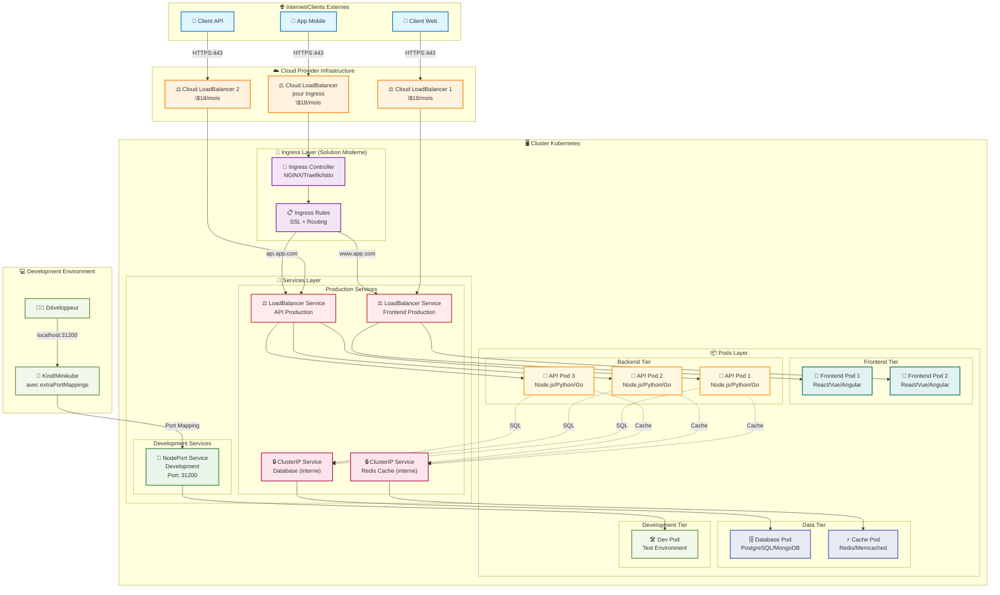


<br/>
<br/>

# 2 -  Comparaison Détaillée par Type

### 1. 🔒 ClusterIP - Communication Interne

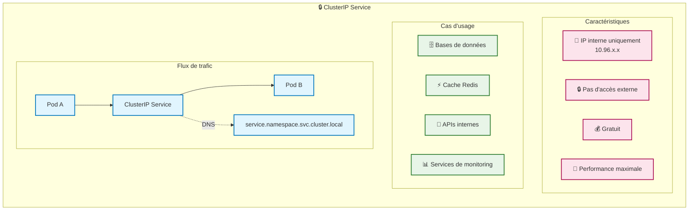

### 2. 🚪 NodePort - Développement

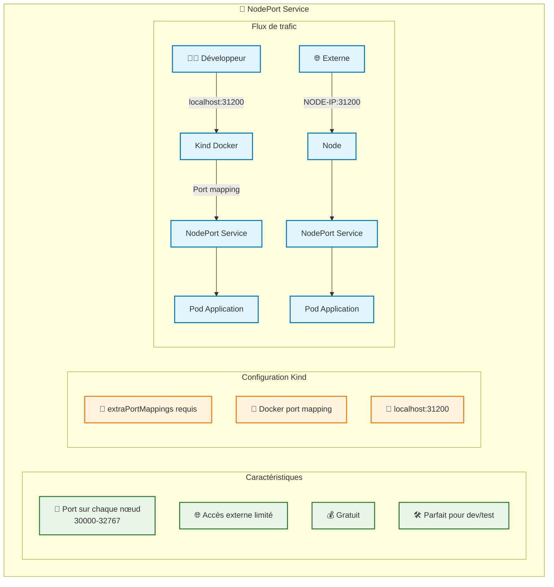

### 3. ⚖️ LoadBalancer - Production Cloud

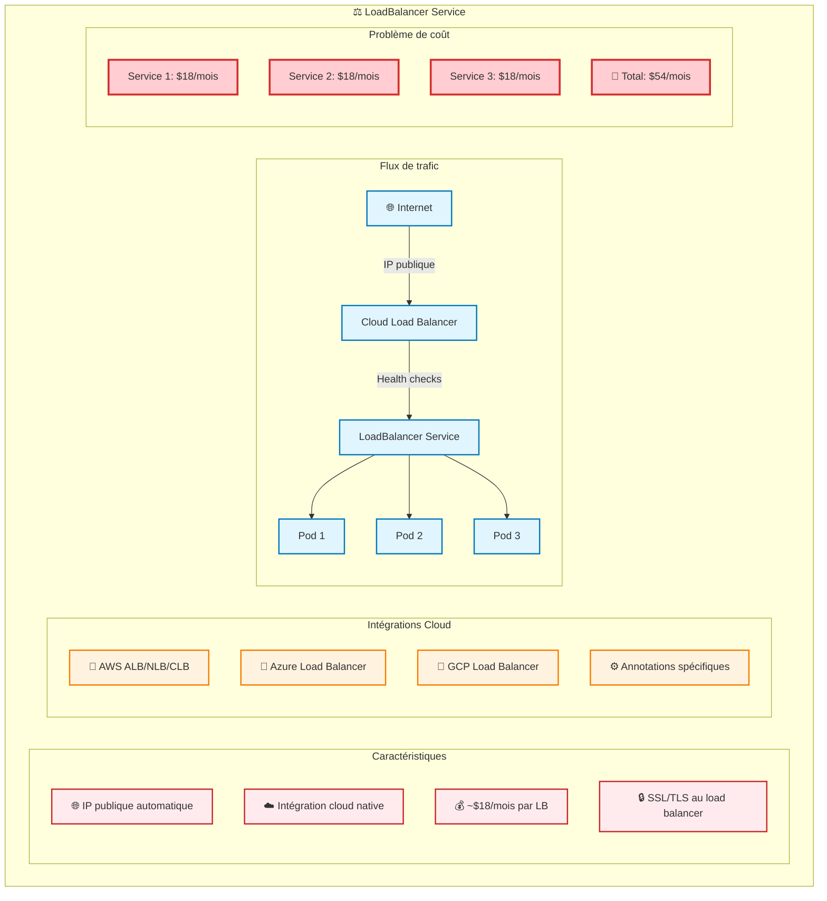

### 4. 🌐 Ingress - Solution Moderne

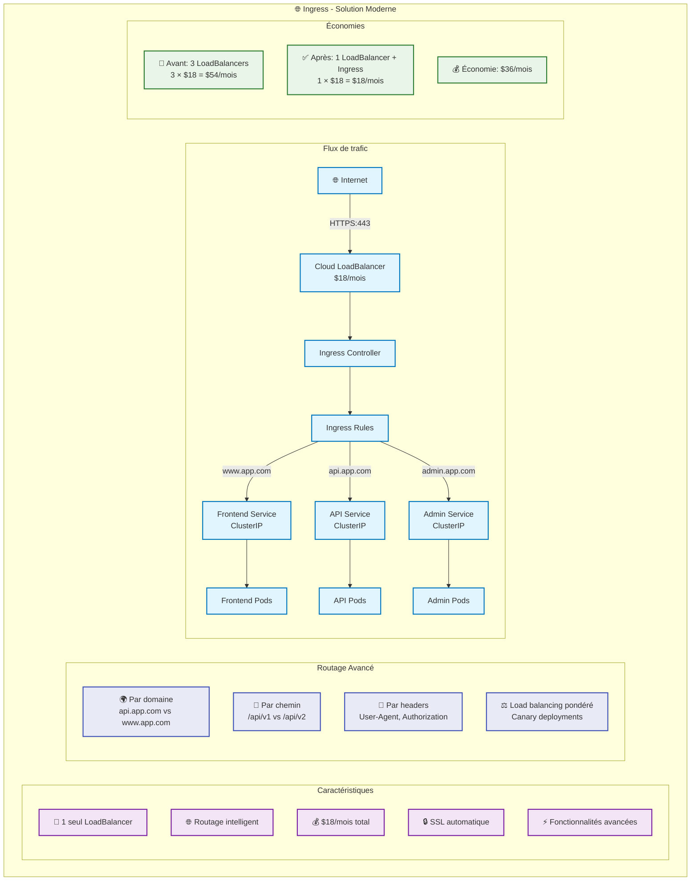

---

## 📊 Matrice de Comparaison

### 🎯 Matrice Décisionnelle

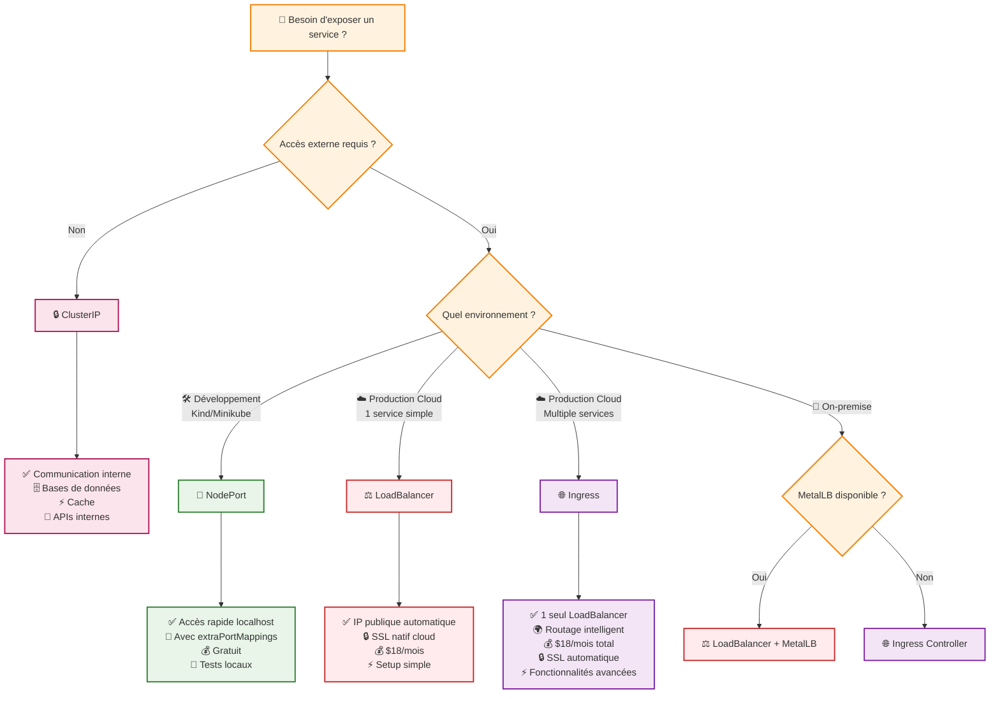

---

## 💰 Analyse des Coûts

### 📊 Comparaison des Coûts Mensuels

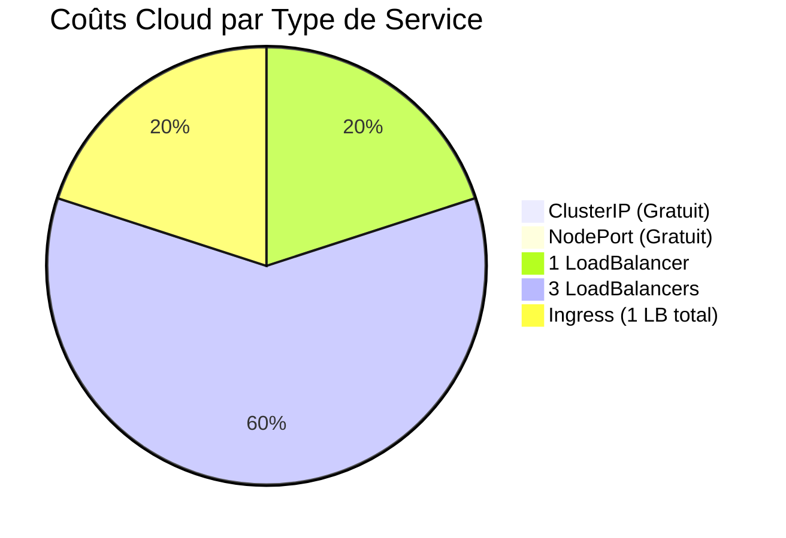

### 📈 Évolution des Coûts avec la Croissance

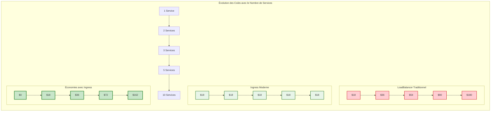

---

## 🔄 Flux de Données Détaillés

### 1. 📡 Flux ClusterIP (Communication Interne)

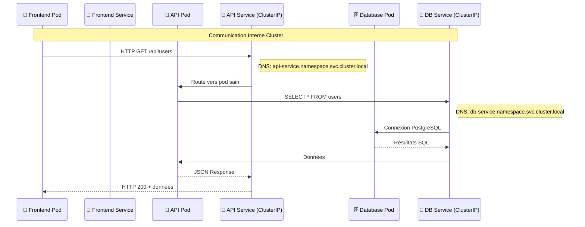

### 2. 🚪 Flux NodePort (Développement)

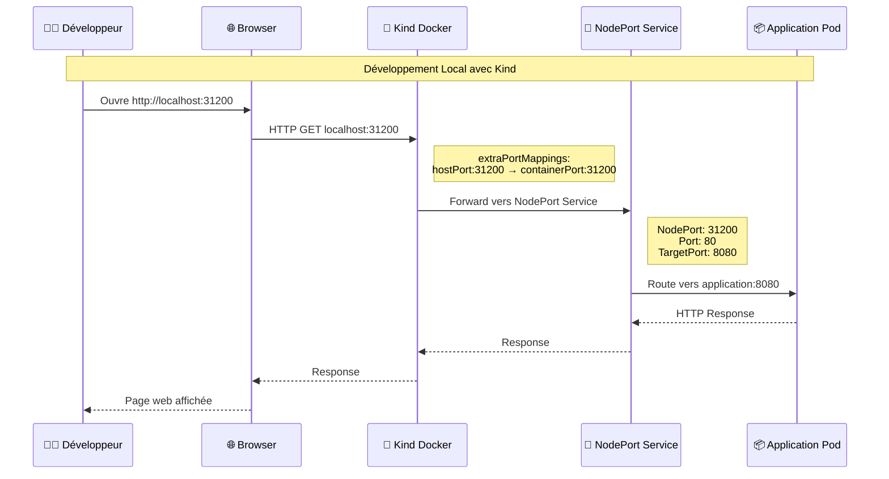

### 3. ⚖️ Flux LoadBalancer (Production Cloud)

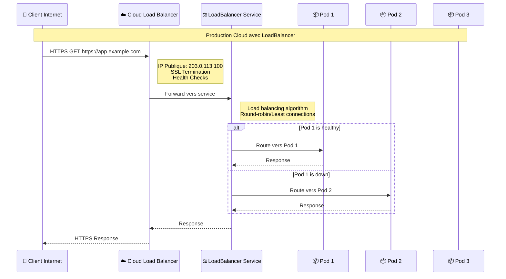

### 4. 🌐 Flux Ingress (Production Moderne)

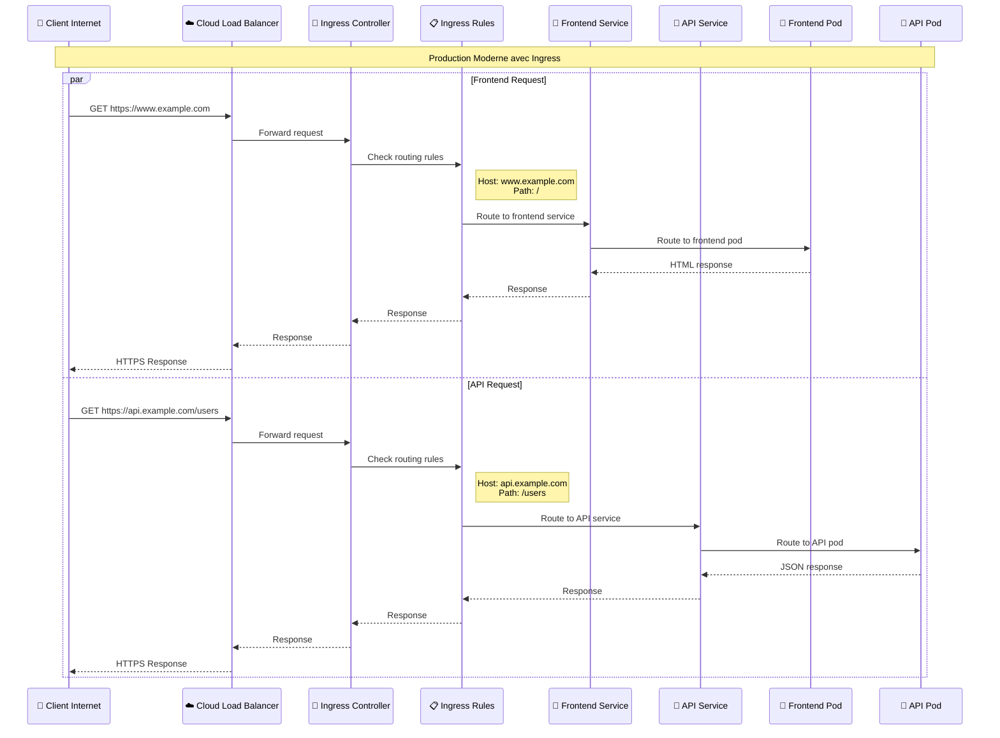

---

## 🛡️ Patterns de Sécurité

### 🔒 Architecture de Sécurité Multi-Niveaux

```mermaid
graph TB
    subgraph "🛡️ Couches de Sécurité Kubernetes"
        subgraph "🌐 Périmètre Externe"
            WAF[🛡️ WAF/DDoS Protection]
            CloudLB[☁️ Cloud Load Balancer<br/>+ SSL Termination]
        end
        
        subgraph "🚪 Ingress Security"
            IngressController[🎯 Ingress Controller]
            AuthN[🔐 Authentication<br/>OAuth/OIDC]
            RateLimit[⏱️ Rate Limiting<br/>1000 req/min]
            CORS[🌍 CORS Policies]
        end
        
        subgraph "🔗 Service Mesh (Optionnel)"
            Istio[🕸️ Istio/Linkerd]
            mTLS[🔒 Mutual TLS]
            PolicyEngine[📋 Policy Engine]
        end
        
        subgraph "🖧 Network Policies"
            NetworkPolicy[🚧 Network Policies]
            Firewall[🔥 Pod-to-Pod Firewall]
            Segmentation[🏗️ Network Segmentation]
        end
        
        subgraph "🔐 Pod Security"
            RBAC[👤 RBAC]
            PSP[🛡️ Pod Security Policies]
            Secrets[🔑 Secrets Management]
        end
    end
    
    Internet[🌐 Internet] --> WAF
    WAF --> CloudLB
    CloudLB --> IngressController
    IngressController --> AuthN
    AuthN --> RateLimit
    RateLimit --> CORS
    CORS --> Istio
    Istio --> mTLS
    mTLS --> PolicyEngine
    PolicyEngine --> NetworkPolicy
    NetworkPolicy --> Firewall
    Firewall --> Segmentation
    Segmentation --> RBAC
    RBAC --> PSP
    PSP --> Secrets
    
    classDef perimeter fill:#ffebee,stroke:#c62828,stroke-width:2px
    classDef ingress fill:#f3e5f5,stroke:#7b1fa2,stroke-width:2px
    classDef mesh fill:#e8eaf6,stroke:#3f51b5,stroke-width:2px
    classDef network fill:#fff3e0,stroke:#f57c00,stroke-width:2px
    classDef pod fill:#e8f5e8,stroke:#2e7d32,stroke-width:2px
    
    class WAF,CloudLB perimeter
    class IngressController,AuthN,RateLimit,CORS ingress
    class Istio,mTLS,PolicyEngine mesh
    class NetworkPolicy,Firewall,Segmentation network
    class RBAC,PSP,Secrets pod
```

---

## 🚀 Patterns de Déploiement

### 1. 🔄 Blue-Green Deployment

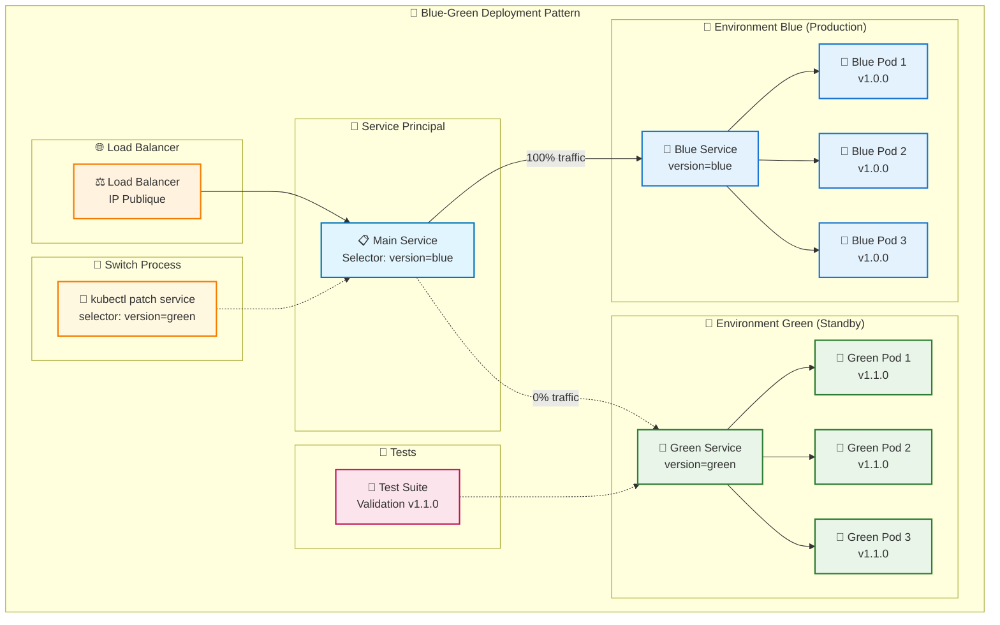

### 2. 🕊️ Canary Deployment avec Ingress

```mermaid
graph TB
    subgraph "🕊️ Canary Deployment avec Ingress"
        subgraph "🌐 Internet"
            Users[👥 100 Utilisateurs]
        end
        
        subgraph "🎯 Ingress Controller"
            MainIngress[📋 Main Ingress<br/>90% traffic]
            CanaryIngress[🕊️ Canary Ingress<br/>10% traffic<br/>nginx.ingress.kubernetes.io/canary: true<br/>nginx.ingress.kubernetes.io/canary-weight: 10]
        end
        
        subgraph "📊 Distribution du Trafic"
            Stable90[📊 90 utilisateurs<br/>Version Stable]
            Canary10[🕊️ 10 utilisateurs<br/>Version Canary]
        end
        
        subgraph "🔗 Services"
            StableService[🔒 Service Stable<br/>version=v1.0.0]
            CanaryService[🕊️ Service Canary<br/>version=v1.1.0]
        end
        
        subgraph "📦 Pods"
            StablePods[📦 Stable Pods<br/>v1.0.0 (3 replicas)]
            CanaryPods[📦 Canary Pods<br/>v1.1.0 (1 replica)]
        end
        
        subgraph "📊 Monitoring"
            Metrics[📊 Metrics<br/>Error Rate, Latency<br/>Business KPIs]
            Alerts[🚨 Alerts<br/>Rollback if issues]
        end
    end
    
    Users --> MainIngress
    Users --> CanaryIngress
    
    MainIngress --> Stable90
    CanaryIngress --> Canary10
    
    Stable90 --> StableService
    Canary10 --> CanaryService
    
    StableService --> StablePods
    CanaryService --> CanaryPods
    
    StablePods --> Metrics
    CanaryPods --> Metrics
    Metrics --> Alerts
    
    classDef users fill:#e1f5fe,stroke:#0277bd,stroke-width:2px
    classDef ingress fill:#f3e5f5,stroke:#7b1fa2,stroke-width:2px
    classDef traffic fill:#fff3e0,stroke:#f57c00,stroke-width:2px
    classDef stable fill:#e8f5e8,stroke:#2e7d32,stroke-width:2px
    classDef canary fill:#fff8e1,stroke:#ff8f00,stroke-width:2px
    classDef monitoring fill:#fce4ec,stroke:#c2185b,stroke-width:2px
    
    class Users users
    class MainIngress,CanaryIngress ingress
    class Stable90,Canary10 traffic
    class StableService,StablePods stable
    class CanaryService,CanaryPods canary
    class Metrics,Alerts monitoring
```

---

## 🔄 Migration Between Service Types

### 📈 Évolution des Services selon la Maturité

```mermaid
gitgraph
    commit id: "🛠️ Dev: NodePort"
    
    branch staging
    checkout staging
    commit id: "🧪 Staging: LoadBalancer"
    commit id: "🔒 Add SSL"
    
    checkout main
    merge staging
    commit id: "🚀 Prod: Single LoadBalancer"
    
    branch microservices
    checkout microservices
    commit id: "🔧 Add API Service"
    commit id: "🗄️ Add Database Service"
    commit id: "⚡ Add Cache Service"
    
    checkout main
    merge microservices
    commit id: "💸 Problem: Multiple LoadBalancers"
    commit id: "🌐 Solution: Migrate to Ingress"
    commit id: "💰 Cost Optimization Complete"
```

### 🔄 Stratégie de Migration Step-by-Step

```mermaid
graph TD
    subgraph "🔄 Migration Strategy: LoadBalancer → Ingress"
        subgraph "📊 Phase 1: Assessment"
            A1[📋 Audit current services]
            A2[💰 Calculate costs]
            A3[🎯 Plan ingress rules]
        end
        
        subgraph "🛠️ Phase 2: Preparation"
            B1[🎯 Install ingress controller]
            B2[🔒 Setup cert-manager]
            B3[📋 Create ingress configs]
            B4[🧪 Test in staging]
        end
        
        subgraph "🚀 Phase 3: Migration"
            C1[🕊️ Start with 1 service]
            C2[📊 Monitor metrics]
            C3[✅ Validate functionality]
            C4[🔄 Migrate remaining services]
        end
        
        subgraph "🧹 Phase 4: Cleanup"
            D1[🗑️ Remove old LoadBalancers]
            D2[💰 Verify cost savings]
            D3[📚 Update documentation]
            D4[🎓 Train team]
        end
    end
    
    A1 --> A2 --> A3
    A3 --> B1 --> B2 --> B3 --> B4
    B4 --> C1 --> C2 --> C3 --> C4
    C4 --> D1 --> D2 --> D3 --> D4
    
    classDef assessment fill:#e3f2fd,stroke:#1976d2,stroke-width:2px
    classDef preparation fill:#fff3e0,stroke:#f57c00,stroke-width:2px
    classDef migration fill:#e8f5e8,stroke:#2e7d32,stroke-width:2px
    classDef cleanup fill:#fce4ec,stroke:#c2185b,stroke-width:2px
    
    class A1,A2,A3 assessment
    class B1,B2,B3,B4 preparation
    class C1,C2,C3,C4 migration
    class D1,D2,D3,D4 cleanup
```

---

## 📊 Tableau de Bord Monitoring

### 🎯 KPIs par Type de Service

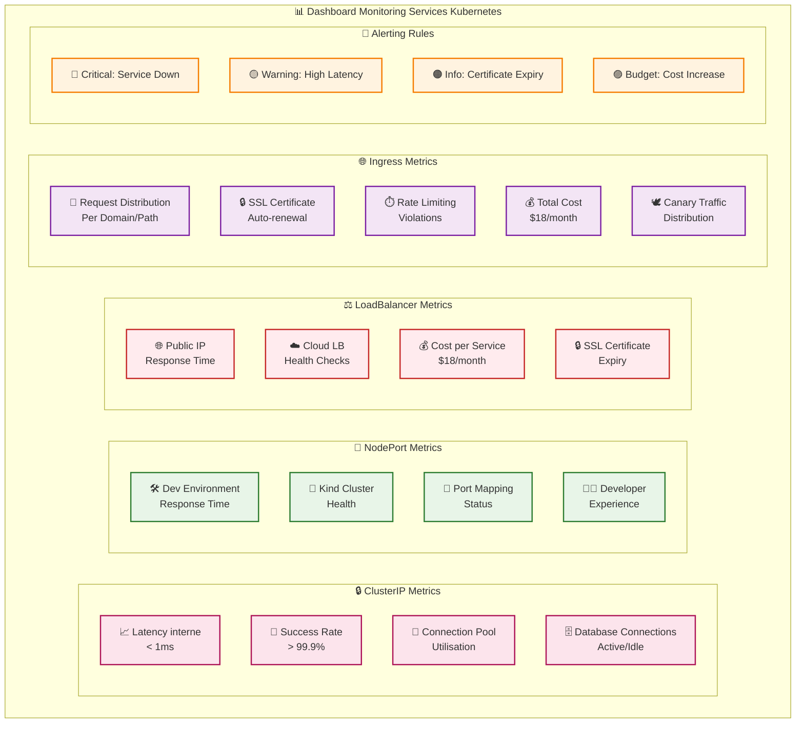

---

## 🎯 Conclusion Visuelle

### 🏆 Recommandations Finales

```mermaid
graph TB
    subgraph "🎯 Guide de Décision Final"
        subgraph "🛠️ Développement"
            DEV[🐳 Kind/Minikube]
            DEV --> DEV_REC[🚪 NodePort<br/>+ extraPortMappings<br/>✅ Simple et gratuit]
        end
        
        subgraph "🧪 Test/Staging"
            STAGE[☁️ Cloud Staging]
            STAGE --> STAGE_REC[🌐 Ingress<br/>+ SSL staging<br/>✅ Configuration proche prod]
        end
        
        subgraph "🚀 Production"
            PROD[☁️ Cloud Production]
            PROD --> PROD_CHOICE{Nombre de services ?}
            PROD_CHOICE -->|1 service| PROD_LB[⚖️ LoadBalancer<br/>✅ Simple setup]
            PROD_CHOICE -->|2+ services| PROD_ING[🌐 Ingress<br/>✅ Économique et scalable]
        end
        
        subgraph "🏢 On-Premise"
            ONPREM[🏢 Infrastructure On-Premise]
            ONPREM --> ONPREM_CHOICE{MetalLB disponible ?}
            ONPREM_CHOICE -->|Oui| ONPREM_LB[⚖️ LoadBalancer<br/>+ MetalLB]
            ONPREM_CHOICE -->|Non| ONPREM_ING[🌐 Ingress Controller<br/>+ NodePort fallback]
        end
        
        subgraph "💰 Optimisation Coûts"
            COST[💸 Optimisation Budget]
            COST --> COST_REC[🌐 Ingress = Meilleur ROI<br/>$18/mois vs $18×N/mois]
        end
        
        subgraph "🔒 Sécurité"
            SEC[🛡️ Exigences Sécurité]
            SEC --> SEC_REC[🌐 Ingress + Network Policies<br/>+ cert-manager + WAF]
        end
    end
    
    classDef dev fill:#e8f5e8,stroke:#2e7d32,stroke-width:2px
    classDef staging fill:#fff3e0,stroke:#f57c00,stroke-width:2px
    classDef prod fill:#ffebee,stroke:#c62828,stroke-width:2px
    classDef onprem fill:#e8eaf6,stroke:#3f51b5,stroke-width:2px
    classDef cost fill:#e1f5fe,stroke:#0277bd,stroke-width:2px
    classDef security fill:#f3e5f5,stroke:#7b1fa2,stroke-width:2px
    classDef recommendation fill:#c8e6c9,stroke:#388e3c,stroke-width:3px
    
    class DEV,DEV_REC dev
    class STAGE,STAGE_REC staging
    class PROD,PROD_CHOICE,PROD_LB,PROD_ING prod
    class ONPREM,ONPREM_CHOICE,ONPREM_LB,ONPREM_ING onprem
    class COST,COST_REC cost
    class SEC,SEC_REC security
```

---

## 📚 Ressources et Next Steps

Cette visualisation exhaustive vous donne une **vision complète** des services Kubernetes ! 

### 🎯 **Key Takeaways**

1. **🔒 ClusterIP** : Fondation pour la communication interne
2. **🚪 NodePort** : Parfait pour le développement (avec Kind/extraPortMappings)
3. **⚖️ LoadBalancer** : Production simple mais coûteux
4. **🌐 Ingress** : Solution moderne économique et puissante

### 🚀 **Next Steps Recommandés**

1. **Pratiquez** avec les exemples du cours
2. **Implémentez** Ingress en production  
3. **Optimisez** vos coûts cloud
4. **Maîtrisez** les patterns de déploiement avancés


**Vous avez maintenant une maîtrise visuelle complète des services Kubernetes ! 🎉**
