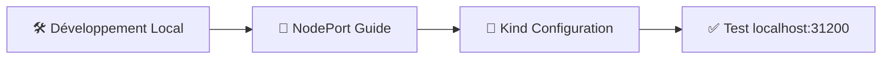
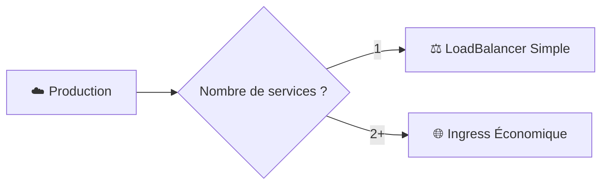
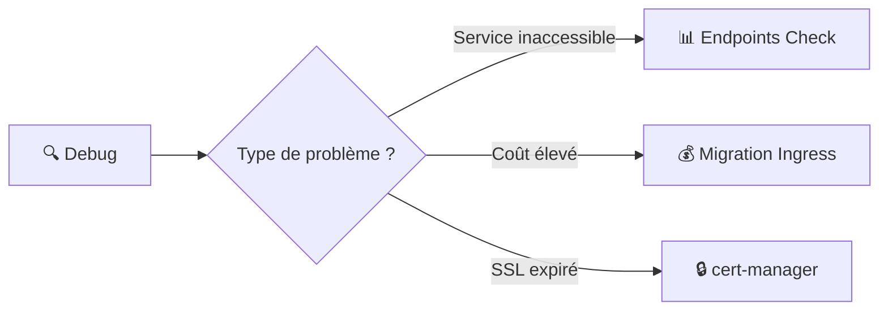

# 🧭 Navigation Rapide - Services Kubernetes

## 🎯 Accès Direct aux Sections

### 📖 **Modules Théoriques**
- 🎯 [Introduction](01-introduction-services-kubernetes.md#-quest-ce-quun-service) - Concepts de base
- 🔒 [ClusterIP](02-clusterip-service.md#-quest-ce-que-clusterip) - Communication interne  
- 🚪 [NodePort](03-nodeport-service.md#-quest-ce-que-nodeport) - Développement local
- ⚖️ [LoadBalancer](04-loadbalancer-service.md#-quest-ce-que-loadbalancer) - Production cloud
- 🌐 [Ingress](05-ingress-solution-moderne.md#-quest-ce-quingress) - Solution moderne

### 🎨 **Visualisations Interactives**
- 🏗️ [Architecture Globale](07-visualisations-services-kubernetes.md#️-architecture-globale-des-services)
- 📊 [Comparaisons Visuelles](07-visualisations-services-kubernetes.md#-comparaison-détaillée-par-type)
- 🎯 [Matrice de Décision](07-visualisations-services-kubernetes.md#-matrice-de-comparaison)
- 💰 [Analyse des Coûts](07-visualisations-services-kubernetes.md#-analyse-des-coûts)
- 🔄 [Flux de Données](07-visualisations-services-kubernetes.md#-flux-de-données-détaillés)

### 📋 **Guides Pratiques**
- 🤔 [Quel Service Choisir ?](06-comparaisons-et-bonnes-pratiques.md#-décision--quel-service-choisir-)
- 🔧 [Configuration Kind](03-nodeport-service.md#-configuration-spéciale-pour-kind)
- 🔒 [SSL Automatique](05-ingress-solution-moderne.md#-ssltls-avec-ingress)
- 🛡️ [Sécurité](06-comparaisons-et-bonnes-pratiques.md#-sécurité-des-services)

---

## 🚀 Raccourcis par Cas d'Usage

### 🛠️ **Je Développe en Local**


**🎯 Aller directement à :**
- [NodePort - Configuration Kind](03-nodeport-service.md#-configuration-spéciale-pour-kind)
- [Exemple kind-config.yaml](examples/kind-config.yaml)

### ☁️ **Je Déploie en Production**


**🎯 Aller directement à :**
- [LoadBalancer - Production](04-loadbalancer-service.md#-exemple-de-production-complet)
- [Ingress - Configuration SSL](05-ingress-solution-moderne.md#-ssltls-avec-ingress)

### 🔍 **Je Debug un Problème**


**🎯 Aller directement à :**
- [Scripts de Debug](06-comparaisons-et-bonnes-pratiques.md#-outils-et-scripts-utiles)
- [Troubleshooting LoadBalancer](04-loadbalancer-service.md#-problèmes-courants-et-solutions)

---

## 📊 Index des Diagrammes

### 🏗️ **Architectures**
| Diagramme | Localisation | Description |
|-----------|--------------|-------------|
| Architecture Globale | [Module 7](07-visualisations-services-kubernetes.md#️-architecture-globale-des-services) | Vue d'ensemble complète |
| ClusterIP Flow | [Module 7](07-visualisations-services-kubernetes.md#-1--clusterip---communication-interne) | Communication interne |
| NodePort Flow | [Module 7](07-visualisations-services-kubernetes.md#-2--nodeport---développement) | Développement local |
| LoadBalancer Flow | [Module 7](07-visualisations-services-kubernetes.md#-3-️-loadbalancer---production-cloud) | Production cloud |
| Ingress Flow | [Module 7](07-visualisations-services-kubernetes.md#-4--ingress---solution-moderne) | Solution moderne |

### 🎯 **Décision et Coûts**
| Diagramme | Localisation | Description |
|-----------|--------------|-------------|
| Flowchart de Décision | [Module 7](07-visualisations-services-kubernetes.md#-matrice-décisionnelle) | Quel service choisir |
| Comparaison Coûts | [Module 7](07-visualisations-services-kubernetes.md#-analyse-des-coûts) | Pie chart des coûts |
| Évolution Coûts | [Module 7](07-visualisations-services-kubernetes.md#-évolution-des-coûts-avec-la-croissance) | Scaling costs |

### 🔄 **Patterns Avancés**
| Diagramme | Localisation | Description |
|-----------|--------------|-------------|
| Blue-Green | [Module 7](07-visualisations-services-kubernetes.md#-1--blue-green-deployment) | Déploiement sans downtime |
| Canary | [Module 7](07-visualisations-services-kubernetes.md#-2-️-canary-deployment-avec-ingress) | Déploiement progressif |
| Migration Strategy | [Module 7](07-visualisations-services-kubernetes.md#-stratégie-de-migration-step-by-step) | LoadBalancer vers Ingress |

---

## ⚡ Commands Cheat Sheet

### 🔍 **Debug Rapide**
```bash
# Lister tous les services
kubectl get svc --all-namespaces

# Debug service spécifique
kubectl describe svc <service-name> -n <namespace>

# Vérifier endpoints
kubectl get endpoints <service-name> -n <namespace>

# Test connectivité
kubectl run test --image=busybox --rm -it --restart=Never -- \
  wget -qO- http://<service-name>.<namespace>/
```

### 🚀 **Déploiement Rapide**
```bash
# NodePort pour développement
kubectl apply -f - <<EOF
apiVersion: v1
kind: Service
metadata:
  name: webapp-dev
spec:
  type: NodePort
  selector:
    app: webapp
  ports:
    - port: 80
      targetPort: 8080
      nodePort: 31200
EOF

# Ingress pour production
kubectl apply -f - <<EOF
apiVersion: networking.k8s.io/v1
kind: Ingress
metadata:
  name: webapp-prod
  annotations:
    cert-manager.io/cluster-issuer: "letsencrypt-prod"
spec:
  ingressClassName: nginx
  tls:
  - hosts:
    - myapp.example.com
    secretName: myapp-tls
  rules:
  - host: myapp.example.com
    http:
      paths:
      - path: /
        pathType: Prefix
        backend:
          service:
            name: webapp-service
            port:
              number: 80
EOF
```

---

## 🎓 Parcours d'Apprentissage Personnalisé

### 👶 **Débutant (2h)**
1. [Introduction](01-introduction-services-kubernetes.md) (30 min)
2. [ClusterIP](02-clusterip-service.md) (45 min)
3. [NodePort](03-nodeport-service.md) (45 min)

### 🛠️ **Développeur (3h)**
1. Révision modules 1-3 (30 min)
2. [Visualisations - NodePort](07-visualisations-services-kubernetes.md#-2--nodeport---développement) (30 min)
3. [LoadBalancer](04-loadbalancer-service.md) (45 min)
4. [Ingress](05-ingress-solution-moderne.md) (45 min)
5. [Comparaisons](06-comparaisons-et-bonnes-pratiques.md#-décision--quel-service-choisir-) (30 min)

### 🚀 **DevOps/Architecte (6h15)**
1. **Tous les modules théoriques** (5h30)
2. **Module Visualisations complet** (45 min)
3. **Patterns avancés** - Focus sur migration et monitoring

---

## 🔖 Signets Utiles

### 📚 **Références Externes**
- [Documentation Kubernetes Services](https://kubernetes.io/docs/concepts/services-networking/service/)
- [NGINX Ingress Controller](https://kubernetes.github.io/ingress-nginx/)
- [cert-manager](https://cert-manager.io/)
- [MetalLB](https://metallb.universe.tf/)

### 🛠️ **Outils Recommandés**
- **Kind** : `kind create cluster --config kind-config.yaml`
- **Helm** : `helm install ingress-nginx ingress-nginx/ingress-nginx`
- **kubectl** : `kubectl get svc --all-namespaces`

---

**🎯 Cette navigation rapide vous permet d'accéder instantanément à l'information dont vous avez besoin !**